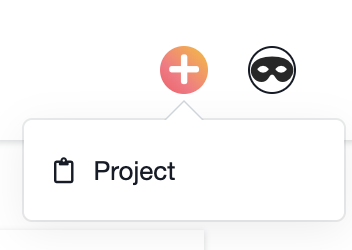

# Edna

#### Only Super Heros are allowed beyond this point

[Edna Live](https://edna-mode.herokuapp.com/) 


## Technologies Used
---
* React / Redux
* [React Beautiful DnD](https://github.com/atlassian/react-beautiful-dnd)
* JavaScript
* JQuery (AJAX)
* Ruby on Rails
* PostgreSQL
* Heroku
* CSS
* Webpack

## Super Feature 
---
Updating position of the section when it is repositioned in backed and then use transaction to update all.

```ruby
    def update_sections_order

        # Using updated_order_list, moving_id, moveto_idx from params
        # => Find all the affected section by repositioning

        if @moving_prev 
            @moving_prev.next_section_id = @moving.next_section_id 
        end
        if @moving_next
            @moving_next.prev_section_id = @moving.prev_section_id 
        end

        if @moved_prev
            @moved_prev.next_section_id = @moving.id
            @moving.prev_section_id = @moved_prev.id
        else
            @moving.prev_section_id = nil
        end

        if @moved_next
            @moved_next.prev_section_id = @moving.id
            @moving.next_section_id = @moved_next.id
        else
            @moving.next_section_id = nil
        end
        
        begin            
            Section.transaction do 
                sections_will_be_updated.each do |section|
                    section.save!
                end
            end
            @sections = Section.ordered_list(@moving)
            render "api/sections/index"
        rescue ActiveRecord::RecordInvalid
            puts json: ["here we go!!!"]            
        end

    end
```


## Super Baby Feature
---
Menu with caret using border styling



```css
.caret {
    position: relative;
}

.caret:before {
    content: '';
    width: 0;
    height: 0;
    position: absolute;
    top: -15px;
    left: -10px;
    border-left: 10px solid transparent;
    border-right: 10px solid transparent;
    border-bottom: 10px solid #cbd4db;
}

.caret:after {
    content: '';
    width: 0;
    height: 0;
    position: absolute;
    top: -14px;
    left: -9px;
    border-left: 9px solid transparent;
    border-right: 9px solid transparent;
    border-bottom: 9px solid #ffffff;
}
```


## Future Works
---
* Add tasks to the sections
* Implement board and column layout 
* Create workspace and teams

  * Allow author to assign tasks & sections to team member
* Optimize back end 